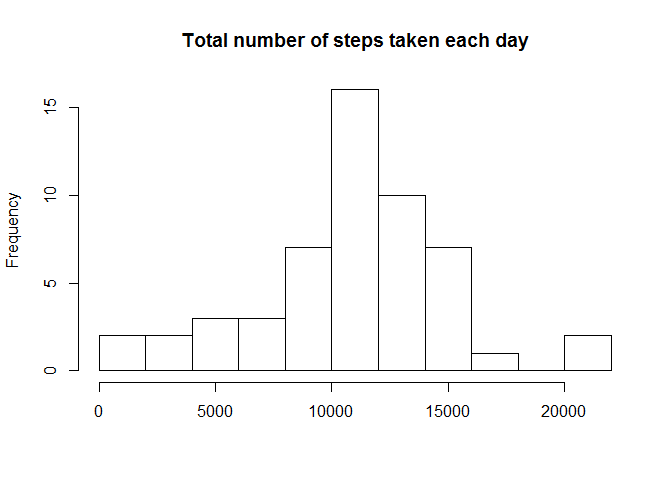
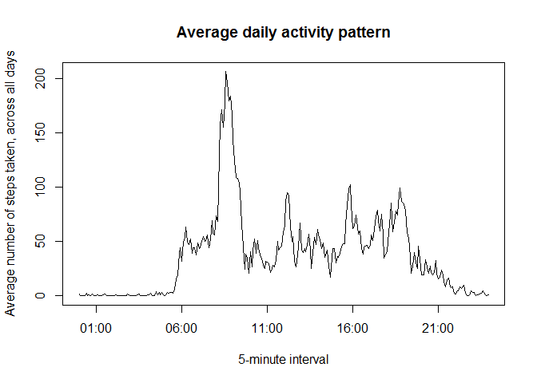
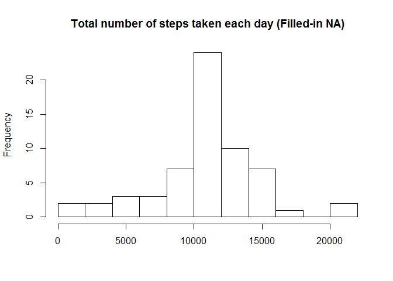
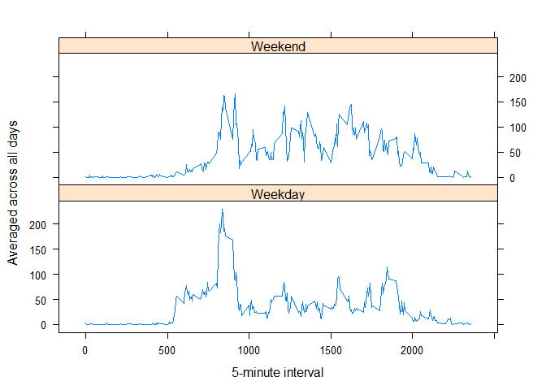

# Reproducible Research: Peer Assessment 1


## Loading and preprocessing the data
Loading the 'dplyr' and 'lattice' library to be utilized.  
Next to read in the csv file and converting the date from a factor to date format.

```r
library(dplyr)
library(lattice)
data <- read.csv('activity.csv')
data$date <- as.Date(data$date)
```

## What is mean total number of steps taken per day?

To ignore the missing figures from the dataset by removing all 'NA' from the dataset.
Plot a Histogram to show the Total number of steps taken each day.

```r
datawithoutna <- data[!is.na(data$steps),]
datawithoutna_sum <- summarise(group_by(datawithoutna,date), steps= sum(steps))
hist(datawithoutna_sum$steps,breaks= 10, xlab= "", main= "Total number of steps taken each day")
```

 

Calculating the Mean & Median of the total number of steps.

```r
mean(datawithoutna_sum$steps)
```

```
## [1] 10766.19
```

```r
median(datawithoutna_sum$steps)
```

```
## [1] 10765
```
## What is the average daily activity pattern?

Plot a time series plot of 5-minutes interval (x-axis) and average number of steps, averaged across all days (y-axis).

```r
datawithoutna_average <- summarise(group_by(datawithoutna,interval), Average = mean(steps))
plot(strptime(sprintf("%04d", datawithoutna_average$interval), format="%H%M"), datawithoutna_average$Average,type = "l", xlab = "5-minute interval", main = "Average daily activity pattern" , ylab = "Average number of steps taken, across all days" )
```

 

The 5-minute interval, on average across all the days in the dataset, contained the maximum number of steps:

```r
datawithoutna_average$interval[which.max(datawithoutna_average$Average)]
```

```
## [1] 835
```

## Imputing missing values
Total number of missing values in the dataset

```r
sum(is.na(data$steps))
```

```
## [1] 2304
```

Strategy for inputting missing data based on the average number of steps taken (average across all days) of the interval as calculated for average daily activity pattern.  
  
Plot a Histogram to show the Total number of steps taken per day with filled-in Missing numbers.

```r
datafilledna <- merge(data,datawithoutna_average)
dataindexna <- which(is.na(datafilledna$steps))
datafilledna$steps[dataindexna] <- datafilledna$Average[dataindexna]

datafilledna_sum <- summarise(group_by(datafilledna,date), steps = sum(steps))

hist(datafilledna_sum$steps,breaks= 10, xlab = "", main = "Total number of steps taken each day (Filled-in NA)")
```

 

Calculating the Mean & Median of the total number of steps with filled-in Missing numbers.

```r
mean(datafilledna_sum$steps)
```

```
## [1] 10766.19
```

```r
median(datafilledna_sum$steps)
```

```
## [1] 10766.19
```

The estimates for mean is same when we ignore missing numbers but the median differ slightly when we filled-in the Missing numbers.

## Are there differences in activity patterns between weekdays and weekends?

Create a new factor variable in the dataset to identify whether the date is Weekday or Weekend.

```r
datafillednawkd <- datafilledna
datafillednawkd$day <- ifelse(weekdays(datafillednawkd$date) %in% c("Saturday","Sunday"), "Weekend","Weekday")
```

Plot a time series plot for Weekday & Weekend of 5-minutes interval (x-axis) and average number of steps, averaged across all days with filled-in Missing numbers (y-axis).

```r
datafillednawkd_average <- summarise(group_by(datafillednawkd,interval,day), Average = mean(steps))
xyplot(Average ~ interval | day,data = datafillednawkd_average, layout = c(1,2), type = "l", xlab = "5-minute interval", ylab = "Averaged across all days")
```

 

End of Reproducible Research - Peer Assignment 1
